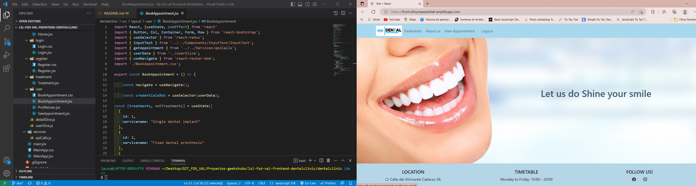
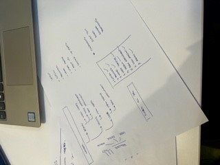

# Welcome to dental clinic Frontend app  
<p aling="center"></p>

<details>
  <summary>Index</summary>
  <ol>
    <li><a href="#about-this-project">About this project</a></li>
    <li><a href="#deploy">Deploy</a></li>
    <li><a href="#stack">Stack</a></li>
    <li><a href="#local-instalation">Local installation</a></li>
    <li><a href="#how-do-we-do-it">How do we do it</a></li>
    <li><a href="#known-bugs">Known bugs</a></li>
    <li><a href="#future-functionalities">Future funtionalities</a></li>
    <li><a href="#licence">Licence</a></li>
    <li><a href="#webgraphy">Webgraphy</a></li>
    <li><a href="#gratitudes">Gratitudes</a></li>
    <li><a href="#contact">Contact</a></li>
  </ol>
</details>

## About this project 🎯


<p aling="center"></p>

<p align="center">The product department GeeksHubs request to create the frontend corresponding to the appointment management system for a Dental Clinic to be connected with a backend created in the last proyect. 
The patient must be able to register in the application, login and access to their client area. In your patient area you should be able to see a list of appointments that has to, in the future and past, create appointments and view the own profile.
There will also be a doctor area with your personal data, which can only be seen by himself and view all patients.
Admin is the las user area w can have acces to all personal data in the app.</p>

## Deploy 🚀
<div align="center">
    <a href="https://front.d3oymjwipxbla6.amplifyapp.com/"><strong>Url a producción </strong></a>🚀🚀🚀
</div>

## Stack
<div align="center">
<a href="https://www.reactjs.com/">
    
</a>
<a href="https://developer.mozilla.org/es/docs/Web/JavaScript">
    
</a>
 <a href="https://redux.js.org/">
    
</a>
<a href="https://react-bootstrap.github.io/">
    
</a>
<a href="https://nodejs.org/en">
    
</a>
<a href="https://github.com/">
    
</a>
<a href="https://git-scm.com/downloads">
    
</a>
<a href="https://aws.amazon.com/es/">
    
</a>
<a href="https://developer.mozilla.org/es/docs/Web/CSS">
    
</a>
<a href="https://developer.mozilla.org/es/docs/Web/CSS">
    
</a>
<a href="https://nextjs.org/">
    
</a>
<a href="https://expressjs.com/">
    
</a>
<a href="https://www.sequelize.org/">
    
</a>
<a href="https://www.npmjs.com/">
    
</a>

## Local installation
This is for backend project:
 Clone the project on your computer
    ` $ git clone 'url-repository' `
 Install all dependencies
    ` $ npm install `
 Create a .env with the credentials on the .env.example
 Start server with:
   ``` $ npm run dev ```
 Connect with the database following:
    ``` $ npx sequelize-cli db:create ```
    ``` $ npx sequelize-cli db:migrate ```
    ``` $ npx sequelize-cli db:seed:all ```
Now is time for frontend project:
 Clone the project on your computer
    ` $ git clone 'url-repository' `
 Install all dependencies
    ` $ npm i `
 Start server with:
   ``` $ npm run dev ```
Last step download the dataBase:
[Data base git hub](https://github.com/LauraSanchezLucas/lsl-fsd-val-dentalclinic)

## How do we do it
For the app of the dental clinic we have implemented different technologies already mentioned above in "Stack" such as JavaScript, NodeJS, React, etc. Firstable I created a plan to face my project in terms of requirements that I wanted to have in our app and marked all the final points of the project, as you can see in the following picture:
<p aling="center"></p>
Once I created the project I started connecting to the backend and then started manipulating the data to render it into my frontend project.
Finally I shaped the visual part of the project through Bootstrap React.

During the process I had few issues, the two most important with the navbar 

During the process I had some issues, the two most important was the dynamic rendering of the Navbar because I was not formulate the ternary functions correctly with the information that the token brought me was not correct, another of the difficulties that I had was the selector of doctors and treatments in book appointment without showing an ID number and with the name of services.

## Known bugs
✅ Pictures into carrusel are not correct adjust.  
⬜ The password in the register area is not encrypted
⬜ Missing the correct instractions for the credentials  

## Future funtionalities
✅ Create the functionality to delete a user by the admin
⬜ Be able to delete appointments by a user and by an admin
⬜ Be able to see the detail of a user and an      appointment by the admin and the doctor  
⬜ Modify both a citation and the profile by the user

## Licencia
This project is belonging to license Creative Commons Legal Code.

## Webgrafia:
To achieve the goal we have collected information from:
  [React documentation](https://www.reactjs.com/)
  [React-bootstrap GeeksHubs](https://react-bootstrap.github.io/)
  [dental clinic website-vitaldent](https://www.vitaldent.com/es/?gclid=c304c159cd09182a4974a55d1f0295ef&gclsrc=3p.ds&)

## Agradecimientos:

I thank to all my colleagues and especially to:

  **Dani**  
<a href="https://www.github.com/datata" target="_blank"></a> 

  **Jose**
<a href="https://github.com/JoseMarin" target="_blank"></a> 

  **Mara**
<a href="https://www.github.com/MaraScampini" target="_blank"></a> 

  **David**  
<a href="https://github.com/Dave86dev" target="_blank"></a>


## Contacto

<a href = "mailto:micorreoelectronico@gmail.com"></a>
<a href="https://www.linkedin.com/in/linkedinUser/" target="_blank"></a> 
</p>